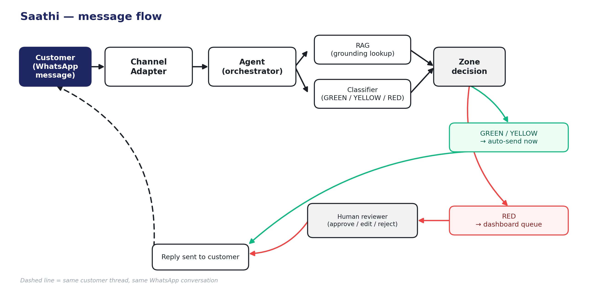

# Architecture

## Flow

```
customer
  -> channel adapter        (webchat widget for the demo, WhatsApp Cloud API adapter behind the same interface)
  -> agent                  (orchestrator: pulls grounding data, drafts a reply, checks sentiment)
       -> RAG                (looks up real product / order / policy data — no LLM call, no guessing)
       -> classifier         (reads the draft's grounding + sentiment, assigns GREEN / YELLOW / RED)
  -> either:
       - auto-send now       (GREEN, or YELLOW logged for visibility)
       - dashboard queue     (RED — a human approves, edits, or rejects before anything reaches the customer)
```

Every module in this chain talks to the next through a narrow, swappable
interface (`channels/index.js`, `rag/index.js`, `classifier/index.js`,
`dashboard_api/index.js`), so the mock store can become a real Shopify
connection, or the webchat widget can become a live WhatsApp number,
without touching the agent or classifier logic.



## Why the classifier is rule-based, not a single LLM call

Saathi deliberately does **not** ask one large model to both draft a
reply and decide whether that reply is safe to send. `classifier/classify.js`
is plain, explicit if/else logic over three pre-computed inputs (RAG
grounding, keyword/phrase rules, a narrowly-scoped sentiment check) —
no model weights, no confidence score to trust blindly. That trade gives
up some nuance an LLM might catch, but buys three things a judge can
verify in the source itself: every escalation traces back to a concrete
matched word or missing data point, not a black-box number; the rule
table can be read start to finish in under a minute and defended line by
line, live; and it fails safe by construction — anything the rules don't
recognize falls through to RED rather than an opaque model deciding it's
probably fine. For a system whose entire pitch is "know when not to act,"
the mechanism deciding that has to be the most inspectable part of the
stack, not the least.
